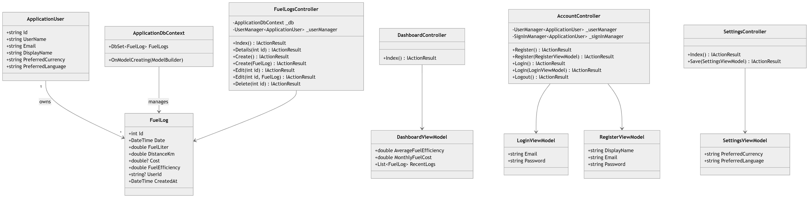

バイク燃費管理PWA 内部設計書

| 項目      | 内容                            |
| ------- | ----------------------------- |
| プロジェクト名 | Bike Fuel Log PWA（バイク燃費管理アプリ） |
| バージョン   | 0.1（ドラフト）                     |
| 作成日     | 2026-05-21                    |
| ステータス   | レビュー前        
|
1. クラス図 

 

2. テーブル構成
2.1 fuel_logs テーブル
| Column Name     | Type     | Description |
| --------------- | -------- | ----------- |
| id              | int      | 一意ID        |
| date            | datetime | 給油日         |
| fuel_liter      | double   | 給油量（L）      |
| distance_km     | double   | 走行距離（km）    |
| cost            | double   | 燃料費         |
| fuel_efficiency | double   | 燃費          |
| user_id         | string   | ユーザーID      |
| created_at      | datetime | 作成日時        |

2.2 users テーブル（ASP.NET Identity）
| Column Name        | Type   | Description |
| ------------------ | ------ | ----------- |
| id                 | string | ユーザーID      |
| email              | string | メールアドレス     |
| display_name       | string | 表示名         |
| preferred_currency | string | 通貨設定        |
| preferred_language | string | 言語設定        |

3. ER図
ApplicationUser

-------------------------

Id

UserName

Email

DisplayName

PreferredCurrency

PreferredLanguage

        1
        |
        |
        N

FuelLog

-------------------------

Id

Date

FuelLiter

DistanceKm

Cost

FuelEfficiency

UserId

CreatedAt

4. 処理フロー
4.1 給油記録追加
開始
 ↓
給油情報入力
 ↓
入力チェック
 ↓ OK
燃費計算
 ↓
DB保存
 ↓
Dashboard更新
 ↓
完了
4.2 ログイン処理
開始
 ↓
Email / Password入力
 ↓
Identity認証
 ↓ 成功
Dashboardへ遷移
 ↓ 失敗
エラーメッセージ表示

5. シーケンス図
5.1 給油記録登録
User

 ↓

FuelLogsController

 ↓

ApplicationDbContext

 ↓

PostgreSQL

 ↓

保存完了
5.2 ログイン
User

 ↓

AccountController

 ↓

SignInManager

 ↓

ASP.NET Identity

 ↓

認証成功

 ↓

Dashboard
6. バリデーション設計

| 項目         | 条件     |
| ---------- | ------ |
| Date       | 必須     |
| FuelLiter  | 0より大きい |
| DistanceKm | 0以上    |
| Cost       | 未入力可   |
| Email      | メール形式  |
| Password   | 8文字以上  |

7. 燃費計算ロジック
uel Efficiency=
Fuel
Distance
	

計算例
Distance = 40 km
Fuel = 2 L
Result = 20 km/L

計算ロジック
if (fuelLiter > 0)
{
    fuelEfficiency = distanceKm / fuelLiter;
}
else
{
    throw new Exception("Fuel must be greater than 0.");
}

8. Controller一覧
DashboardController
| メソッド    | 内容          |
| ------- | ----------- |
| Index() | Dashboard表示 |
AccountController
| メソッド                        | 内容       |
| --------------------------- | -------- |
| Register()                  | 登録画面表示   |
| Register(RegisterViewModel) | ユーザー登録   |
| Login()                     | ログイン画面表示 |
| Login(LoginViewModel)       | ログイン処理   |
| Logout()                    | ログアウト処理  |

FuelLogsController
| メソッド                  | 内容     |
| --------------------- | ------ |
| Index()               | 履歴一覧表示 |
| Details(int id)       | 詳細表示   |
| Create()              | 登録画面表示 |
| Create(FuelLog)       | 登録処理   |
| Edit(int id)          | 編集画面表示 |
| Edit(int id, FuelLog) | 更新処理   |
| Delete(int id)        | 削除処理   

SettingsController
| メソッド                    | 内容     |
| ----------------------- | ------ |
| Index()                 | 設定画面表示 |
| Save(SettingsViewModel) | 設定保存