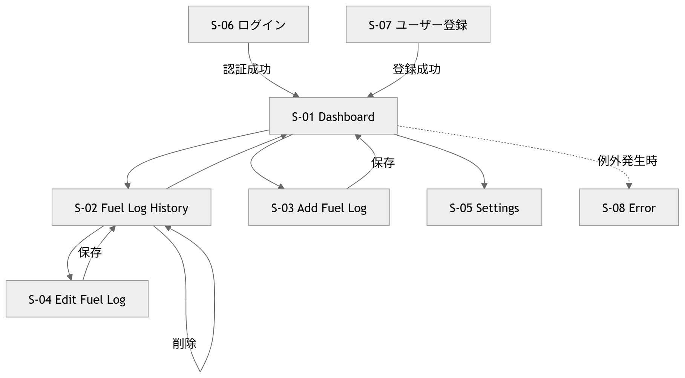

1. 画面一覧
1.1 画面（GETでビューを返すもの
）
| ID   | 画面名              | URL                   | コントローラ.アクション                      | 認証 | 概要                |
| ---- | ---------------- | --------------------- | --------------------------------- | -- | ----------------- |
| S-01 | Dashboard        | `/`                   | `DashboardController.Index`       | 要  | 平均燃費・月間燃料費・最新履歴表示 |
| S-02 | Fuel Log History | `/FuelLogs`           | `FuelLogsController.Index`        | 要  | 給油履歴一覧表示          |
| S-03 | Add Fuel Log     | `/FuelLogs/Create`    | `FuelLogsController.Create` (GET) | 要  | 給油記録追加            |
| S-04 | Edit Fuel Log    | `/FuelLogs/Edit/{id}` | `FuelLogsController.Edit` (GET)   | 要  | 給油記録編集            |
| S-05 | Settings         | `/Settings`           | `SettingsController.Index`        | 要  | 通貨・言語設定           |
| S-06 | Login            | `/Account/Login`      | `AccountController.Login`         | 不要 | ログイン画面            |
| S-07 | Register         | `/Account/Register`   | `AccountController.Register`      | 不要 | ユーザー登録            |
| S-08 | Error            | `/Home/Error`         | `HomeController.Error`            | 不要 | エラー画面             |

1.2 画面を持たない POST アクション
| アクション  | URL                          | トリガー      | 概要                    |
| ------ | ---------------------------- | --------- | --------------------- |
| ログアウト  | `POST /Account/Logout`       | ナビバー      | サインアウト後 Dashboard へ戻る |
| 給油記録保存 | `POST /FuelLogs/Create`      | Saveボタン   | 新規給油記録保存              |
| 給油記録更新 | `POST /FuelLogs/Edit/{id}`   | Saveボタン   | 編集内容保存                |
| 給油記録削除 | `POST /FuelLogs/Delete/{id}` | Deleteボタン | 確認後削除                 |

2. 画面遷移図

3. 各画面ワイヤーフレーム概要
本節では構成要素のみ記載する。詳細UIはFigmaで設計予定。

S-01 Dashboard
平均燃費表示
月間燃料費表示
最新給油履歴表示
Add Fuel Log ボタン
ナビバー（履歴・設定・ログアウト）

--------------------------------
Dashboard
--------------------------------

Average Fuel Efficiency
20.4 km/L

Monthly Fuel Cost
¥4,500

[ + Add Fuel Log ]

Recent Logs
-----------------
2026/05/01
20 km/L

--------------------------------
S-02 Fuel Log History
給油履歴一覧
Edit / Delete ボタン
日付順表示
--------------------------------
Fuel Log History
--------------------------------

2026/05/01
40km / 2L
20km/L

[Edit] [Delete]

----------------------------

2026/05/05
35km / 1.8L
19.4km/L

--------------------------------
S-03 Add Fuel Log
給油日入力
給油量入力
走行距離入力
燃料費入力（任意）
Save ボタン
--------------------------------
Add Fuel Log
--------------------------------

Date

Fuel Amount (L)

Distance (km)

Cost

[ Save ]

--------------------------------
S-04 Edit Fuel Log
S-03と同様のレイアウト
既存値を表示
Save ボタン
S-05 Settings
通貨設定（JPY / VND）
言語設定（English / 日本語 / Vietnamese
--------------------------------
Settings
--------------------------------

Currency
( ) JPY
( ) VND

Language
( ) English
( ) 日本語
( ) Vietnamese

[ Save ]

S-06 Error
エラーメッセージ表示
Dashboardへ戻るリンク
4. 機能一覧
| ID   | 機能名    | 関連画面      | 概要           | 認証 |
| ---- | ------ | --------- | ------------ | -- |
| F-01 | 給油記録追加 | S-03      | 給油データ登録      | 要  |
| F-02 | 燃費自動計算 | S-01,S-02 | km/L 自動計算    | 要  |
| F-03 | 履歴一覧表示 | S-02      | 履歴表示         | 要  |
| F-04 | 平均燃費表示 | S-01      | 全体平均表示       | 要  |
| F-05 | 給油記録編集 | S-04      | 記録更新         | 要  |
| F-06 | 給油記録削除 | S-02      | 記録削除         | 要  |
| F-07 | 通貨切替   | S-05      | 円 / ドン切替     | 要  |
| F-08 | 多言語切替  | S-05      | 英語・日本語・ベトナム語 | 要  |
| F-09 | ログイン   | S-06      | Cookie認証     | 不要 |
| F-10 | ユーザー登録 | S-07      | 新規アカウント登録    | 不要 |

4.2 入力チェック
| 項目          | 条件       |
| ----------- | -------- |
| Date        | 必須       |
| Fuel Amount | 0より大きい数値 |
| Distance    | 0以上      |
| Cost        | 未入力可     |
| Password    | 8文字以上    |

4.3 燃費計算ルール

Fuel Efficiency=
Fuel
Distance
	
計算例
Distance = 40 km
Fuel = 2 L
Result = 20 km/L
5. 権限ルール
| 操作     | 権限       |
| ------ | -------- |
| 給油履歴閲覧 | ログインユーザー |
| 給油記録追加 | ログインユーザー |
| 編集     | 作成者本人    |
| 削除     | 作成者本人    |
| 設定変更   | ログインユーザー |